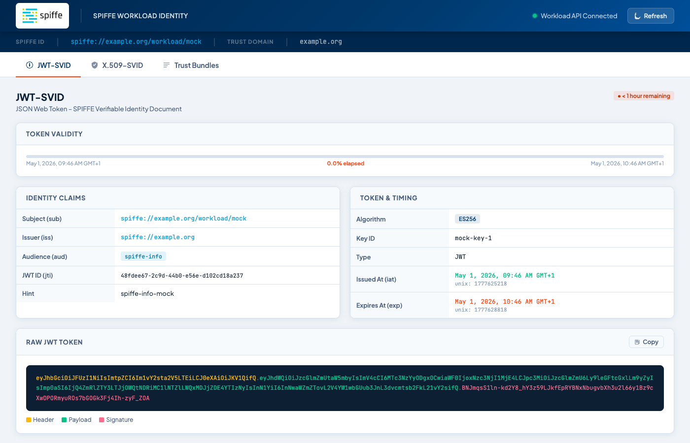

# spiffe-info

A debug and inspection tool for [SPIFFE](https://spiffe.io/) workload identity. It connects to a SPIFFE Workload API, streams X.509-SVID rotation events to stdout, and serves a web UI for exploring JWT-SVIDs, X.509-SVIDs, and X.509 trust bundles.

Built to make SPIFFE identity visible without writing custom tooling.



## Usage

### Kubernetes

```yaml
# deploy/kubernetes.yaml — mounts the SPIRE agent socket automatically
kubectl apply -f deploy/kubernetes.yaml
kubectl port-forward svc/spiffe-info 8080:80
```

Open `http://localhost:8080`.

### Docker

```sh
docker run --rm \
  -e SPIFFE_ENDPOINT_SOCKET=unix:///run/spire/sockets/agent.sock \
  -v /run/spire/sockets:/run/spire/sockets \
  -p 8080:80 \
  ghcr.io/mattiasgees/spiffe-info:latest
```

### Binary

```sh
spiffe-info --workload-api-addr unix:///run/spire/sockets/agent.sock --port 8080
```

### Configuration

All options accept both a flag and an environment variable. Flags take precedence.

| Flag | Env var | Default |
|---|---|---|
| `--workload-api-addr` | `SPIFFE_ENDPOINT_SOCKET` | `unix:///tmp/spire-agent/public/api.sock` |
| `--port` | `PORT` | `80` |
| `--jwt-audience` | `JWT_AUDIENCE` | `spiffe-info` |
| `--log-level` | `LOG_LEVEL` | `info` |

## Web UI

Three tabs, all data fetched live from the Workload API:

- **JWT-SVID** — raw token with colour-coded header/payload/signature, claims, validity bar
- **X.509-SVID** — certificate details, algorithms, SANs, fingerprint, PEM download
- **Trust Bundles** — all CA certificates grouped by trust domain; view details, download PEM

## Development

### Prerequisites

- Go 1.24+
- Docker (for `make docker`)

### Commands

```sh
make dev          # start mock Workload API + spiffe-info with no SPIRE needed
make test         # run all tests with race detector
make build        # build spiffe-info binary → bin/spiffe-info
make build-mock   # build mock binary → bin/mock-workload-api
make build-all    # cross-compile for linux/amd64, linux/arm64, darwin/amd64, darwin/arm64
make docker       # build container image tagged spiffe-info:dev
make clean        # remove bin/
```

`make dev` wires up the mock Workload API (self-signed certs, simulated rotation every 30s) and spiffe-info at `http://localhost:8080`. No SPIRE installation needed.

### Mock Workload API

The `mock-workload-api` binary implements the full gRPC SPIFFE Workload API spec locally:

```sh
bin/mock-workload-api \
  --spiffe-id spiffe://example.org/workload/my-service \
  --rotation-interval 30s \
  --ttl 1h

# then in another terminal:
SPIFFE_ENDPOINT_SOCKET=unix:///tmp/spiffe-info-mock.sock PORT=8080 bin/spiffe-info
```

### Project layout

```
cmd/
  spiffe-info/          main binary
  mock-workload-api/    local dev mock
internal/
  config/               flag + env var config
  workload/             go-spiffe watcher (push model), Store interface
  printer/              stdout SVID formatter
  server/               HTTP server and /api/* handlers
web/                    embedded React SPA + static assets
deploy/                 Kubernetes manifests
.github/workflows/      CI/CD (test on PR, publish on main, release on tag)
```

## Releases

Container images are published to `ghcr.io/mattiasgees/spiffe-info`:

- `latest` — built on every commit to `main`
- `vX.Y.Z` — built on every GitHub release

Binary archives for all four platforms are attached to each GitHub release.
